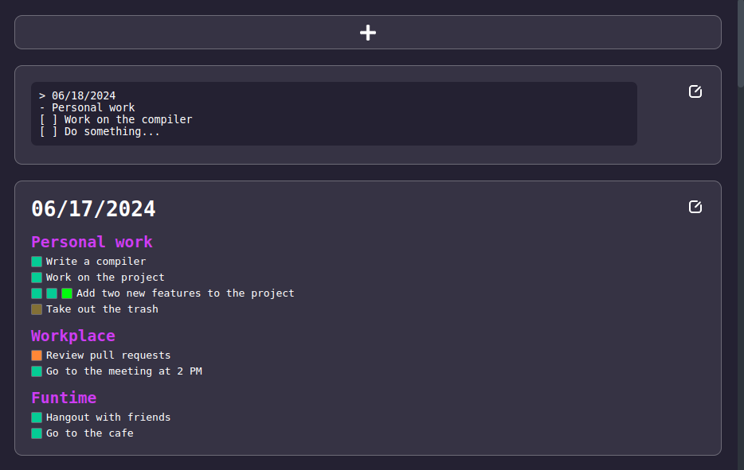

# TEAMS

Tasks Environment Automatic Managment Syntax. Made by Nick.



The interface consists of multiple "day cells" with their own tasks. Each cell has an edit button in the upper right corner, by pressing this button we can edit the contents of the whole "day cell" using the TEAMS language. I don't know why I named it that.

We have different kinds of "checkboxes". Each checkbox can be:

- **Empty** - transparent - `[ ]`
- **Completed** - green - `[+]`
- **Missed** - orange - `[-]`
- **Cancelled** - brown - `[!]`
- **Overwork** - lime - `[x]`

Most importantly the language has feature of separating tasks into different categories using subtitles. You can split up your personal work and work assigned to you at your job. Or split up your tasks to work towards your goals, such as "programming" section with programming related tasks and "fitness" section with physical exercises and such.

```tasks
> 06/18/2024
- Programming
[+][ ][ ] Solve 3 LeetCode problems
[ ] Work on a project
[!] Write a documentation for the project
- Fitness
[ ] Go for a run
[ ] Do... something...
```

This program stores all of the data in a plain text file. Which is an universal format. You can stop using this program whenever you feel like it, and you tasks will remain just the same in your text file.